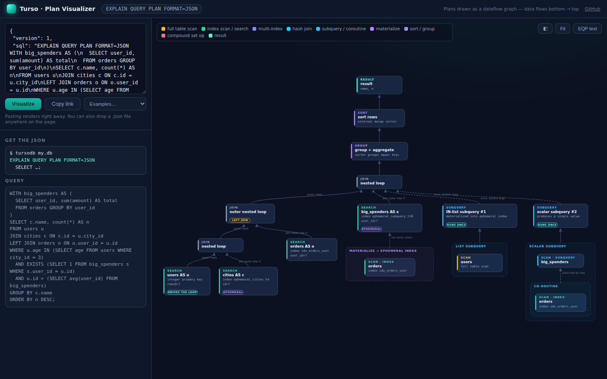

# Turso Plan Visualizer

Draws [Turso](https://github.com/tursodatabase/turso) `EXPLAIN QUERY PLAN`
output as an interactive dataflow graph, in the spirit of MySQL Workbench's
Visual Explain and [pgexplain.dev](https://www.pgexplain.dev/). Paste a plan,
see the query: full-table scans, join shapes, subquery coroutines, shared CTE
materializations, and repeated-per-row work all jump out.

**Use it here: <https://lemikaelf.github.io/turso-explain-temp/>**



## Usage

1. Get a plan as JSON from any Turso database (needs a build with
   [`EXPLAIN QUERY PLAN FORMAT=JSON`](https://github.com/tursodatabase/turso/blob/main/docs/eqp-json.md)):

   ```console
   $ tursodb my.db
   tursodb> EXPLAIN QUERY PLAN FORMAT=JSON SELECT * FROM users WHERE age > 21;
   {"version":1,"sql":"...","nodes":[...]}
   ```

2. Paste it into the tool (it renders on paste), or drop a `.json` file
   anywhere on the page.

Data flows from the bottom of the graph to the `RESULT` node at the top.
Click any node for its raw plan fields; the **EQP text** button shows the
classic text tree for comparison. Nothing ever leaves your browser: the page
is a single static HTML file with no backend.

**Share links.** Rendering updates the URL to `#plan=<compressed plan>`, so
copying the address (or pressing **Copy link**) gives a link that reproduces
the graph. The plan travels in the URL fragment, which browsers never send to
the server.

**Examples.** The dropdown holds pre-generated plans (joins, CTEs, hash
joins, recursive CTEs, window functions...) so you can explore without a
database.

## Embedding

The page is self-contained, so an iframe is all it takes:

```html
<iframe
  src="https://lemikaelf.github.io/turso-explain-temp/?embed=1"
  style="width: 100%; height: 640px; border: 0"
></iframe>
```

- `?embed=1` hides the page header.
- Adding a `#plan=...` fragment (copy one with **Copy link**) renders that
  plan on load and folds the input pane away — good for showing one specific
  plan in docs or a blog post. The ◧ button brings the pane back.

In a Next.js site, drop the same iframe into any page or component. To serve
it from your own origin instead, copy `index.html` and `examples.js` into
`public/` and iframe `/index.html?embed=1`.

## Development

There is no build step. Open `index.html` in a browser (works from `file://`)
and edit.

`examples.js` holds the pre-generated example plans. To regenerate them after
a plan-format change, point the script at a `tursodb` binary built with
`FORMAT=JSON` support:

```console
$ node scripts/gen-examples.mjs path/to/tursodb
```

The demo schema lives in `scripts/demo-schema.sql`.

Deploys to GitHub Pages happen automatically on push (see
`.github/workflows/pages.yml`).

## Plan format

The JSON format is produced and documented by Turso itself:
[docs/eqp-json.md](https://github.com/tursodatabase/turso/blob/main/docs/eqp-json.md).
The tool checks the document's `version` field and warns when a plan is newer
than it understands.

## License

[MIT](LICENSE.md)
